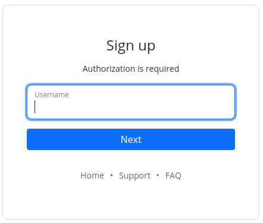
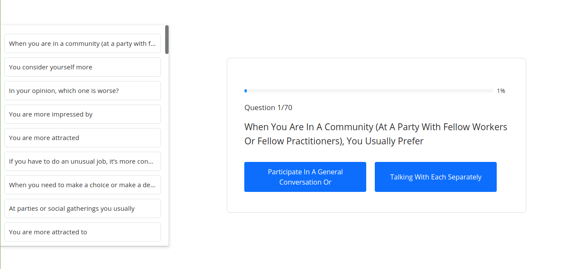
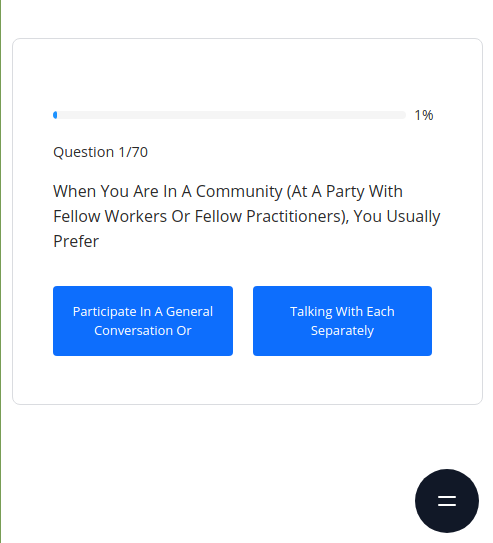
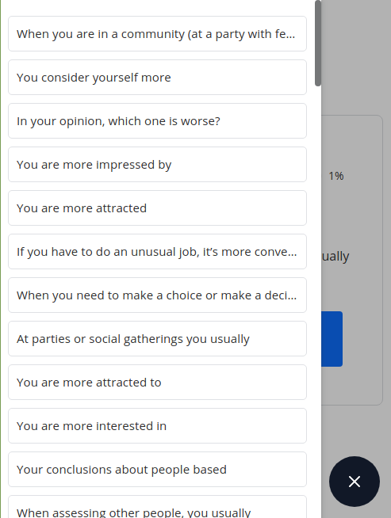

# QUIZ

Hello, This web project is built on the React class of components. I think it comes with simple code and great functionality. There are 2 local identifiers, these are the ones that check whether the user is logged in and the second is if the user agrees to the rules of use of the website (Cookie) If you want to download a project it is simple you just need a Github Desktop or terminal. In the worst case, download the project and throw it in the file. Be sure to note the `npm install` while in the project file

## Where can I see the former bugs of the project?

The project had many bugs but could be fixed. It was not difficult to work on this project but it gives me good practice. If you find a problem while using it, you can contribute to the development of the project and send notes. [See Here](https://github.com/asyncfinkd/quiz/issues?q=is%3Aissue+is%3Aclosed)

## Where can I see project photos?

 

 

 

## Responsive

 
 

 
 

<b>If you do not like the stylization is handwritten CSS and edit or contribute to the design.</b>

## Contributing

The main purpose of this repository is to continue evolving Quiz core, making it faster and easier to use. Development of Quiz happens in the open on GitHub, and we are grateful to the community for contributing bugfixes and improvements. Read below to learn how you can take part in improving Quiz.

## [Code of Conduct](CODE_OF_CONDUCT.md)

Quiz has adopted a Code of Conduct that we expect project participants to adhere to. Please read the full text so that you can understand what actions will and will not be tolerated.

## [Contributing Guide](CONTRIBUTING.md)

Read our contributing guide to learn about our development process, how to propose bugfixes and improvements, and how to build and test your changes to Quiz.

## License

Quiz is [MIT licensed](LICENSE)
